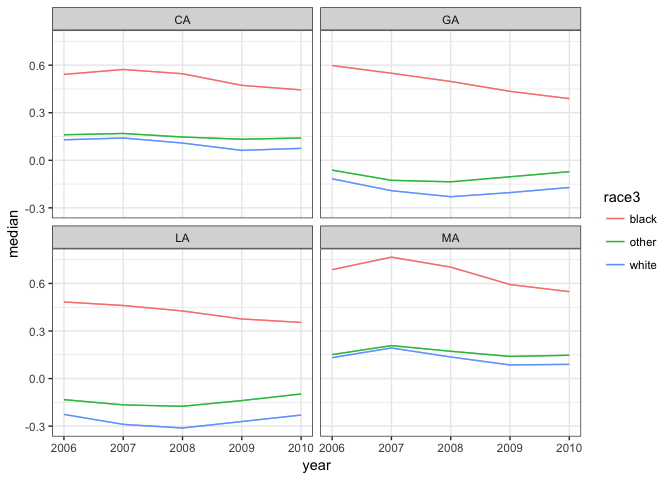
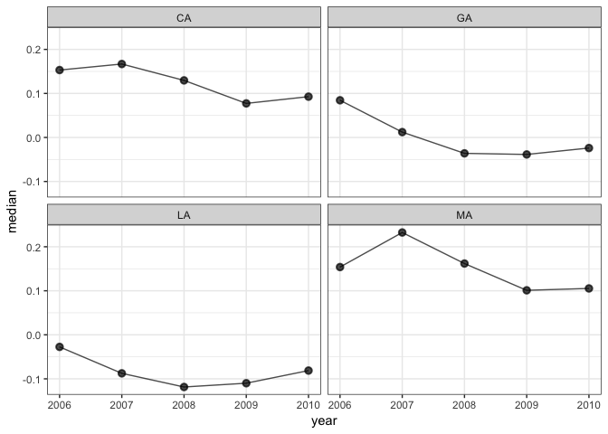

[](https://travis-ci.org/jamesdunham/dgo)

dgo is an R package for dynamic estimation of group-level opinion.

dgo implements DGIRT, a Bayesian method for estimating subpopulation groups' average conservatism (or other trait) from individuals' responses to dichotomous questions. It is "dynamic" both in the sense that groups are allowed to evolve over time and in the sense that the model "borrows strength" from other time periods, to a degree specified by the user. [This document](https://github.com/jamesdunham/dgo/blob/master/inst/dgirt_details.pdf) describes the model in detail. It is a modified version of the hierarchical group-level IRT model implemented by [Caughey and Warshaw 2015](http://pan.oxfordjournals.org/content/early/2015/02/04/pan.mpu021.full.pdf+html).

Prerequisites
-------------

Installation requires [RStan](http://mc-stan.org/interfaces/rstan.html) and its prerequisites, in particular a C++ toolchain. If you don't have RStan, follow its "[Getting Started](https://github.com/stan-dev/rstan/wiki/RStan-Getting-Started)" guide before continuing.

Installation
------------

dgo can be installed from [GitHub](https://github.com/jamesdunham/dgo) using [devtools](https://github.com/hadley/devtools/):

``` r
# install.packages("devtools")
devtools::install_github("jamesdunham/dgo", dependencies = TRUE)
```

Getting started
---------------

``` r
library(dgo)
#> Loading required package: Rcpp
#> Warning: package 'Rcpp' was built under R version 3.3.2
```

The minimal workflow from raw data to estimation is:

1.  shape input data using the `shape` function; and
2.  pass the result to the `dgirt` function to fit a DGIRT model.

### Set RStan options

These are RStan's recommended options on a local, multicore machine with excess RAM:

``` r
rstan_options(auto_write = TRUE)
options(mc.cores = parallel::detectCores())
```

### Prepare input data with `shape`

DGIRT models are *dynamic*, so we need to specify which variable in the data represents time. They are also *group-level*, with groups typically defined by a variable for respondents' local geographic area and one or more variables for respondent characteristics.

The `time_filter` and `geo_filter` arguments optionally subset the data. Finally, `shape` requires the names of the survey identifier and survey weight variables in the data.

``` r
dgirt_in <- shape(opinion,
                  item_names = c("abortion", "affirmative_action",
                    "stemcell_research", "gaymarriage_amendment",
                    "partialbirth_abortion"),
                  time_name = "year",
                  geo_name = "state",
                  group_names = "race3",
                  geo_filter = c("CA", "GA", "LA", "MA"),
                  survey_name = "source",
                  weight_name = "weight")
#> Applying restrictions, pass 1...
#>  Dropped 5 rows for missingness in covariates
#>  Dropped 8 rows for lacking item responses
#> Applying restrictions, pass 2...
#>  No changes
```

The reshaped and subsetted data can be summarized in a few ways before model fitting.

``` r
summary(dgirt_in)
#> Items:
#> [1] "abortion"              "affirmative_action"    "gaymarriage_amendment"
#> [4] "partialbirth_abortion" "stemcell_research"    
#> Respondents:
#>    23,632 in `item_data`
#> Grouping variables:
#> [1] "year"  "state" "race3"
#> Time periods:
#> [1] 2006 2007 2008 2009 2010
#> Local geographic areas:
#> [1] "CA" "GA" "LA" "MA"
#> Hierarchical parameters:
#> [1] "GA"         "LA"         "MA"         "race3other" "race3white"
#> Modifiers of hierarchical parameters:
#> character(0)
#> Constants:
#>   Q   T   P   N   G   H   D 
#>   5   5   5 300  12   1   1
```

Response counts by survey-year:

``` r
get_n(dgirt_in, by = c("year", "source"))
#>    year    source    n
#> 1: 2006 CCES_2006 5644
#> 2: 2007 CCES_2007 1841
#> 3: 2008 CCES_2008 4724
#> 4: 2009 CCES_2009 2154
#> 5: 2010 CCES_2010 9269
```

Response counts by item-year:

``` r
get_item_n(dgirt_in, by = "year")
#>    year abortion affirmative_action stemcell_research
#> 1: 2006     5275               4750              2483
#> 2: 2007     1690               1557              1705
#> 3: 2008     4697               4704              4002
#> 4: 2009     2141               2147                 0
#> 5: 2010     9204               9241              9146
#>    gaymarriage_amendment partialbirth_abortion
#> 1:                  2642                  5064
#> 2:                  1163                  1684
#> 3:                  4265                     0
#> 4:                     0                     0
#> 5:                  9226                     0
```

### Fit a model with `dgirt`

`dgirt` fits a model to data from `shape`. Under the hood, this function uses RStan for MCMC sampling, and arguments can be passed to RStan's `stan` via the `...` argument of `dgirt`. This will almost always be desirable, at a minimum to specify the number of sampler iterations, chains, and cores.

``` r
dgirt_out <- dgirt(dgirt_in, iter = 1500, chains = 4, cores = 4, seed = 42,
                   refresh = 0)
```

The model results are held in a `dgirt_fit` object. Methods from RStan like `extract` are available if needed because `dgirt_fit` is a subclass of `stanfit`. But dgo provides its own methods for typical post-estimation tasks.

### Work with `dgirt` results

For a high-level summary of the result, use `summary`.

``` r
summary(dgirt_out)
#> dgirt samples from 4 chains of 1500 iterations, 750 warmup, thinned every 1 
#>   Drawn Fri Jan 13 10:28:18 2017 
#>   Package version 0.2.7 
#>   Model version 2017_01_04 
#>   137 parameters; 60 theta_bars (year, state and race3)
#>   5 periods 2006 to 2010 
#> 
#> n_eff
#>    Min. 1st Qu.  Median    Mean 3rd Qu.    Max. 
#>   53.53  134.30  237.40  358.90  373.30 1999.00
#> 
#> Rhat
#>    Min. 1st Qu.  Median    Mean 3rd Qu.    Max. 
#>   1.000   1.007   1.013   1.017   1.022   1.064
#> 
#> Elapsed time
#>    chain warmup sample  total
#> 1:     1 1M 27S 2M 45S 3M 72S
#> 2:     2 1M 38S 2M 41S 3M 79S
#> 3:     3  1M 5S 2M 33S 3M 38S
#> 4:     4 1M 53S 2M 44S 3M 97S
```

To summarize posterior samples, use `summarize`. The default output gives summary statistics for the `theta_bar` parameters, which represent the mean of the latent outcome for the groups defined by time, local geographic area, and the demographic characteristics specified in the earlier call to `shape`.

``` r
head(summarize(dgirt_out))
#>        param state race3 year      mean         sd    median       q_025
#> 1: theta_bar    CA black 2006 0.5495122 0.08408488 0.5417941  0.40123321
#> 2: theta_bar    CA black 2007 0.5836415 0.10280742 0.5729066  0.41597341
#> 3: theta_bar    CA black 2008 0.5591099 0.10671551 0.5459816  0.38828767
#> 4: theta_bar    CA black 2009 0.4900812 0.09874492 0.4727758  0.34593141
#> 5: theta_bar    CA black 2010 0.4515506 0.07719338 0.4440954  0.32062133
#> 6: theta_bar    CA other 2006 0.1539503 0.06932572 0.1610716 -0.01282908
#>        q_975
#> 1: 0.7383885
#> 2: 0.8161483
#> 3: 0.8002534
#> 4: 0.7411483
#> 5: 0.6175475
#> 6: 0.2726472
```

Alternatively, `summarize` can apply arbitrary functions to posterior samples for whatever parameter is given by its `pars` argument. Enclose function names with quotes. For convenience, `"q_025"` and `"q_975"` give the 2.5th and 97.5th posterior quantiles.

``` r
summarize(dgirt_out, pars = "xi", funs = "var")
#>    param year         var
#> 1:    xi 2006 0.021263542
#> 2:    xi 2007 0.008842126
#> 3:    xi 2008 0.008028949
#> 4:    xi 2009 0.007556206
#> 5:    xi 2010 0.007754970
```

To access posterior samples in tabular form use `as.data.frame`. By default, this returns post-warmup samples for the `theta_bar` parameters. Use a `pars` argument to access other parameters.

``` r
head(as.data.frame(dgirt_out))
#>        param state race3 year iteration     value
#> 1: theta_bar    CA black 2006         1 0.5022184
#> 2: theta_bar    CA black 2006         2 0.4988011
#> 3: theta_bar    CA black 2006         3 0.3952569
#> 4: theta_bar    CA black 2006         4 0.4325513
#> 5: theta_bar    CA black 2006         5 0.5027754
#> 6: theta_bar    CA black 2006         6 0.5107315
```

To poststratify the results use `poststratify`.

The following example uses the group population proportions bundled as `targets` to reweight and aggregate estimates to strata defined by state-years.

``` r
head(targets)
#>   year state     black gender education   age urban    race4         prop
#> 1 1930    AK non-black   male     no hs 18-29 rural    white 9.267599e-05
#> 2 1930    AK non-black female hs degree   65+ rural    black 0.000000e+00
#> 4 1930    AK non-black   male     no hs 18-29 rural    black 0.000000e+00
#> 5 1930    AK non-black female hs degree   65+ rural hispanic 0.000000e+00
#> 6 1930    AK non-black   male     no hs 18-29 rural hispanic 3.372235e-07
#> 7 1930    AK non-black   male     no hs 18-29 rural    other 7.372030e-05
#>   race3
#> 1 white
#> 2 black
#> 4 black
#> 5 white
#> 6 white
#> 7 other
```

The `prop` variable in `targets` gives row-year population proportions. For poststratification of `dgirt()` group estimates (i.e., theta-bars), we require the yearly population proportion for each group. We can calculate these proportions by summing over the row proportions in `targets` by group-year.

``` r
targets <- aggregate(prop ~ year + state + race3, targets, sum)
# proportions should sum to one within years 
all(round(aggregate(prop ~ year, targets, sum)$prop, 1) == 1)
#> [1] TRUE
head(targets)
#>   year state race3         prop
#> 1 1930    AK black 1.739559e-05
#> 2 1931    AK black 1.807912e-05
#> 3 1932    AK black 1.876266e-05
#> 4 1933    AK black 1.944619e-05
#> 5 1934    AK black 2.012972e-05
#> 6 1935    AK black 2.081326e-05
```

``` r
poststratify(dgirt_out, targets, strata_names = c("state", "year"),
             aggregated_names = "race3", prop_name = "prop")
#>     state year       value
#>  1:    CA 2006  0.15311249
#>  2:    CA 2007  0.16681224
#>  3:    CA 2008  0.12960380
#>  4:    CA 2009  0.07734238
#>  5:    CA 2010  0.09267092
#>  6:    GA 2006  0.08445442
#>  7:    GA 2007  0.01214468
#>  8:    GA 2008 -0.03608996
#>  9:    GA 2009 -0.03860841
#> 10:    GA 2010 -0.02400916
#> 11:    LA 2006 -0.02746051
#> 12:    LA 2007 -0.08750371
#> 13:    LA 2008 -0.11852634
#> 14:    LA 2009 -0.10993133
#> 15:    LA 2010 -0.08122249
#> 16:    MA 2006  0.15387750
#> 17:    MA 2007  0.23240183
#> 18:    MA 2008  0.16187042
#> 19:    MA 2009  0.10105306
#> 20:    MA 2010  0.10533596
```

To plot the results use `dgirt_plot`. This plots summaries of posterior samples by time period. By default, it shows a 95% credible interval around posterior medians for the `theta_bar` parameters, for each local geographic area.

``` r
dgirt_plot(dgirt_out, y_min = NULL, y_max = NULL)
```



Output from `dgirt_plot` can be customized to some extent using objects from the ggplot2 package.

`dgirt_plot` can also plot the `data.frame` output from `poststratify`, but this requires that we identify the relevant variables in the `data.frame`.

Below, `poststratify` aggregates over the demographic grouping variable `race3`, resulting in a `data.frame` of estimates by state-year. So, in the subsequent call to `dgirt_plot`, we pass the names of the `state` and `year` variables. The `group_names` argument is given as `NULL`, because no other grouping variables remain.

``` r
ps <- poststratify(dgirt_out, targets, strata_names = c("state", "year"),
  aggregated_names = "race3", prop_name = "prop")
head(ps)
#>    state year      value
#> 1:    CA 2006 0.15311249
#> 2:    CA 2007 0.16681224
#> 3:    CA 2008 0.12960380
#> 4:    CA 2009 0.07734238
#> 5:    CA 2010 0.09267092
#> 6:    GA 2006 0.08445442
dgirt_plot(ps, group_names = NULL, time_name = "year", geo_name = "state")
```



Troubleshooting
---------------

Please [report issues](https://github.com/jamesdunham/dgo/issues) that you encounter.

OS X only: RStan creates temporary files during estimation in a location given by `tempdir`, typically an arbitrary location in `/var/folders`. If a model runs for days, these files can be cleaned up while still needed, which induces an error. A good solution is to set a safer path for temporary files, using an environment variable checked at session startup. As described in `?tempdir`,

> The environment variables ‘TMPDIR’, ‘TMP’ and ‘TEMP’ are checked in turn and the first found which points to a writable directory is used: if none succeeds ‘/tmp’ is used. The path should not contain spaces.

For help setting environment variables, see the Stack Overflow question [here](https://stackoverflow.com/questions/17107206/change-temporary-directory). Confirm the new path before starting your model run by restarting R and checking the output from `tempdir()`.

``` r
# Problematic temporary directories on OS X look like this
tempdir()   
#> [1] "/var/folders/2p/_d3c95qd6ljg28j1f5l2jqxm0000gn/T//Rtmp38a10A"
```

Contributing and citing
-----------------------

dgo is under development and we welcome [suggestions](https://github.com/jamesdunham/dgo/issues).

The package citation is

> Dunham, James, Devin Caughey, and Christopher Warshaw. 2017. dgo: Dynamic Estimation of Group-level Opinion. R package. <https://jamesdunham.github.io/dgo/>.
