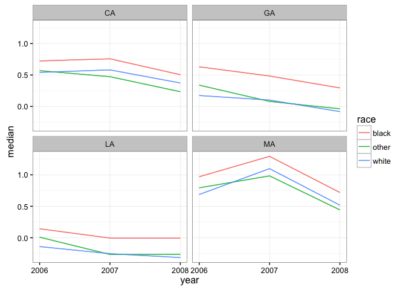
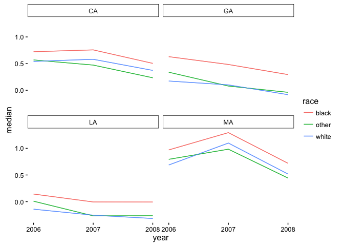
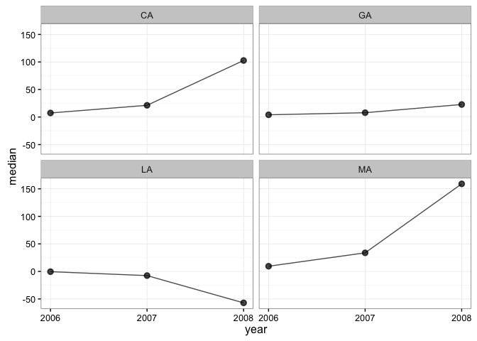

[](https://travis-ci.org/jamesdunham/dgo)

dgo is an R package for the dynamic estimation of group-level opinion. The package implements a Bayesian group-level IRT approach developed by [Caughey and Warshaw 2015](http://pan.oxfordjournals.org/content/early/2015/02/04/pan.mpu021.full.pdf+html) that models latent traits at the level of demographic and/or geographic groups rather than individuals. This approach uses a hierarchical model to borrow strength cross-sectionally and dynamic linear models to do so across time. The group-level estimates can be weighted to generate estimates for geographic units, such states. T

dgo can be used to estimate subpopulation groups' average latent conservatism (or other latent trait) from individuals' responses to dichotomous questions.  It can also be used to estimate smoothed dynamic estimates of subpopulation groups' average responses on individual survey questions. For instance, it could be used to estimate public opinion in each state on same-sex marriage or the Affordable Care Act.

This model opens up new areas of research on historical public opinion in the United States at the subnational level. It also enables scholars of comparative politics to estimate dynamic models of public opinion opinion at the country or subnational level.

[This document](https://github.com/jamesdunham/dgo/blob/master/inst/dgirt_details.pdf) describes the model in detail. 

Prerequisites
-------------

Installation requires [RStan](http://mc-stan.org/interfaces/rstan.html) and its prerequisites, in particular a C++ toolchain. If you don't have RStan, follow its "[Getting Started](https://github.com/stan-dev/rstan/wiki/RStan-Getting-Started)" guide before continuing.

Installation
------------

dgo can be installed from [GitHub](https://github.com/jamesdunham/dgo) using [devtools](https://github.com/hadley/devtools/):

    devtools::install_github("jamesdunham/dgo", dependencies = TRUE)

Getting started
---------------

``` r
library(dgo)
#> Loading required package: Rcpp
```

The minimal workflow from raw data to estimation is:

1.  shape input data using the `shape` function; and
2.  pass the result to the `dgirt` or `dgmrp` function to fit a DGIRT model.

### Set RStan options

These are RStan's recommended options on a local, multicore machine with excess RAM:

``` r
rstan_options(auto_write = TRUE)
options(mc.cores = parallel::detectCores())
```

### Prepare input data with `shape`

DGIRT models are *dynamic*, so we need to specify which variable in the data represents time. They are also *group-level*, with groups defined by one variable for respondents' local geographic area and one or more variables for respondent characteristics.

The `time_filter` and `geo_filter` arguments optionally subset the data. Finally, `shape` requires the names of the survey identifier and survey weight variables in the data.

``` r
dgirt_in <- shape(opinion,
                  item_names = "Q_cces2006_abortion",
                  time_name = "year",
                  geo_name = "state",
                  group_names = "race",
                  geo_filter = c("CA", "GA", "LA", "MA"),
                  survey_name = "source",
                  weight_name = "weight")
#> Applying restrictions, pass 1...
#>  Dropped 5 rows for missingness in covariates
#>  Dropped 555 rows for lacking item responses
#> Applying restrictions, pass 2...
#>  No changes
```

The reshaped and subsetted data can be summarized in a few ways before model fitting.

``` r
summary(dgirt_in)
#> Items:
#> [1] "Q_cces2006_abortion"
#> Respondents:
#>    11,662 in `item_data`
#> Grouping variables:
#> [1] "year"  "state" "race" 
#> Time periods:
#> [1] 2006 2007 2008
#> Local geographic areas:
#> [1] "CA" "GA" "LA" "MA"
#> Hierarchical parameters:
#> [1] "GA"        "LA"        "MA"        "raceother" "racewhite"
#> Modifiers of hierarchical parameters:
#> character(0)
#> Constants:
#>  Q  T  P  N  G  H  D 
#>  1  3  5 36 12  1  1
```

Response counts by survey-year:

``` r
get_n(dgirt_in, by = c("year", "source"))
#>    year    source    n
#> 1: 2006 CCES_2006 5275
#> 2: 2007 CCES_2007 1690
#> 3: 2008 CCES_2008 4697
```

Response counts by item-year:

``` r
get_item_n(dgirt_in, by = "year")
#>    year Q_cces2006_abortion
#> 1: 2006                5275
#> 2: 2007                1690
#> 3: 2008                4697
```

### Fit a model with `dgirt` or `dgmrp`

`dgirt` and `dgmrp` fit estimation models to data from `shape`. `dgirt` can be used to estimate a latent variable based on responses to multiple survey questions (e.g., latent policy conservatism), while `dgmrp` can be used to estimate public opinion on an individual survey question using a dynamic multi-level regression and post-stratification (MRP) model.  

Under the hood, these functions use RStan for MCMC sampling, and arguments can be passed to RStan's `stan` via the `...` argument of `dgirt` and `dgmrp`. This will almost always be desirable, at a minimum to specify the number of sampler iterations, chains, and cores.

``` r
dgirt_out <- dgmrp(dgirt_in, iter = 1500, chains = 4, cores = 4, seed = 42,
                   refresh = 0)
```

The model results are held in a `dgirtfit` object. Methods from RStan like `extract` are available if needed because `dgirtfit` is a subclass of `stanfit`. But dgo provides its own methods for typical post-estimation tasks.

### Work with `dgirt` results

For a high-level summary of the result, use `summary`.

``` r
summary(dgirt_out)
#> dgirt samples from 4 chains of 1500 iterations, 750 warmup, thinned every 1 
#>   Drawn Wed Oct 12 17:51:36 2016 
#>   Package version 0.2.7 
#>   Model version 2016_09_14 
#>   87 parameters; 36 theta_bars (year, state and race)
#>   3 periods 2006 to 2008 
#> 
#> n_eff
#>    Min. 1st Qu.  Median    Mean 3rd Qu.    Max. 
#>   12.80   32.86  164.10  498.70  668.90 3000.00
#> 
#> Rhat
#>    Min. 1st Qu.  Median    Mean 3rd Qu.    Max.    NA's 
#>  0.9987  1.0090  1.0340  1.0680  1.1020  1.3440       1
#> 
#> Elapsed time
#>    chain warmup sample total
#> 1:     1    24S    23S   47S
#> 2:     2    23S    12S   35S
#> 3:     3    23S    26S   49S
#> 4:     4    23S    11S   34S
```

To summarize posterior samples, use `summarize`. The default output gives summary statistics for the `theta_bar` parameters, which represent the mean of the latent outcome for the groups defined by time, local geographic area, and the demographic characteristics specified in the earlier call to `shape`.

``` r
head(summarize(dgirt_out))
#>        param state  race year      mean         sd    median      q_025
#> 1: theta_bar    CA black 2006 0.7313650 0.07382754 0.7227690 0.59176969
#> 2: theta_bar    CA black 2007 0.7495567 0.15265220 0.7573332 0.45713464
#> 3: theta_bar    CA black 2008 0.5094344 0.10957805 0.5044693 0.30718504
#> 4: theta_bar    CA other 2006 0.5719195 0.07254187 0.5688034 0.43018528
#> 5: theta_bar    CA other 2007 0.4556545 0.14006876 0.4726040 0.17145830
#> 6: theta_bar    CA other 2008 0.2286040 0.08608999 0.2342414 0.05529104
#>        q_975
#> 1: 0.8833364
#> 2: 1.0433169
#> 3: 0.7227528
#> 4: 0.7218028
#> 5: 0.7031576
#> 6: 0.3914443
```

Alternatively, `summarize` can apply arbitrary functions to posterior samples for whatever parameter is given by its `pars` argument. Enclose function names with quotes. For convenience, `"q_025"` and `"q_975"` give the 2.5th and 97.5th posterior quantiles.

``` r
summarize(dgirt_out, pars = "xi", funs = "var")
#>    param year        var
#> 1:    xi 2006 0.01731874
#> 2:    xi 2007 0.08775190
#> 3:    xi 2008 0.08601946
```

To access posterior samples in tabular form use `as.data.frame`. By default, this method returns post-warmup samples for the `theta_bar` parameters, but like other methods takes a `pars` argument.

``` r
head(as.data.frame(dgirt_out))
#>        param state  race year iteration     value
#> 1: theta_bar    CA black 2006         1 0.7792932
#> 2: theta_bar    CA black 2006         2 0.5651822
#> 3: theta_bar    CA black 2006         3 0.7411416
#> 4: theta_bar    CA black 2006         4 0.7830560
#> 5: theta_bar    CA black 2006         5 0.8044931
#> 6: theta_bar    CA black 2006         6 0.7175995
```

To poststratify the results use `poststratify`. The following example uses the group population proportions bundled as `state_year_targets` to reweight and aggregate estimates to strata defined by state-years. Read `help("poststratify")` for more details.

``` r
poststratify(dgirt_out, state_year_targets, strata_names = c("state", "year"),
             aggregated_names = "race")
#>     state year       value
#>  1:    CA 2006  0.56257458
#>  2:    CA 2007  0.56187201
#>  3:    CA 2008  0.34683927
#>  4:    GA 2006  0.31502381
#>  5:    GA 2007  0.21040094
#>  6:    GA 2008  0.03422257
#>  7:    LA 2006 -0.04473326
#>  8:    LA 2007 -0.18798638
#>  9:    LA 2008 -0.22418653
#> 10:    MA 2006  0.70691300
#> 11:    MA 2007  1.09862611
#> 12:    MA 2008  0.52356572
```

To plot the results use `dgirt_plot`. This method plots summaries of posterior samples by time period. By default, it shows a 95% credible interval around posterior medians for the `theta_bar` parameters, for each local geographic area. For this (unconverged) toy example we omit the CIs.

``` r
dgirt_plot(dgirt_out, y_min = NULL, y_max = NULL)
```



Output from `dgirt_plot` can be customized to some extent using objects from the ggplot2 package.

``` r
dgirt_plot(dgirt_out, y_min = NULL, y_max = NULL) + theme_classic()
```



`dgirt_plot` can also plot the `data.frame` output from `poststratify`. This requires arguments that identify the relevant variables in the `data.frame`. Below, `poststratify` aggregates over the demographic grouping variable `race`, resulting in a `data.frame` of estimates by state-year. So, in the subsequent call to `dgirt_plot`, we pass the names of the state and year variables. The `group_names` argument is `NULL` because there are no grouping variables left after aggregating over `race`.

``` r
ps <- poststratify(dgirt_out, state_year_targets,
                   strata_names = c("state", "year"), aggregated_names = "race")
head(ps)
#>    state year      value
#> 1:    CA 2006 0.56257458
#> 2:    CA 2007 0.56187201
#> 3:    CA 2008 0.34683927
#> 4:    GA 2006 0.31502381
#> 5:    GA 2007 0.21040094
#> 6:    GA 2008 0.03422257
dgirt_plot(ps, group_names = NULL, time_name = "year", geo_name = "state")
```



Troubleshooting
---------------

Please [report issues](https://github.com/jamesdunham/dgo/issues) that you encounter.

OS X only: RStan creates temporary files during estimation in a location given by `tempdir`, typically an arbitrary location in `/var/folders`. If a model runs for days, these files can be cleaned up while still needed, which induces an error. A good solution is to set a safer path for temporary files, using an environment variable checked at session startup. As described in `?tempdir`,

> The environment variables ‘TMPDIR’, ‘TMP’ and ‘TEMP’ are checked in turn and the first found which points to a writable directory is used: if none succeeds ‘/tmp’ is used. The path should not contain spaces.

For help setting environment variables, see the Stack Overflow question [here](https://stackoverflow.com/questions/17107206/change-temporary-directory). Confirm the new path before starting your model run by restarting R and checking the output from `tempdir()`.

``` r
# Problematic temporary directories on OS X look like this
tempdir()   
#> [1] "/var/folders/2p/_d3c95qd6ljg28j1f5l2jqxm0000gn/T//Rtmp38a10A"
```

Contributing and citing
-----------------------

dgo is under development and we welcome [suggestions](https://github.com/jamesdunham/dgo/issues).

The package citation is

> Dunham, James, Devin Caughey, and Christopher Warshaw. 2016. dgo: Dynamic Estimation of Group-level Opinion. R package. <https://jamesdunham.github.io/dgo/>.
