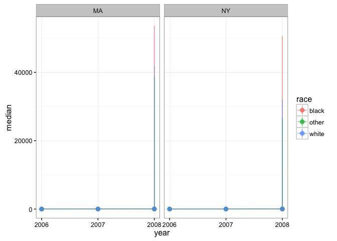
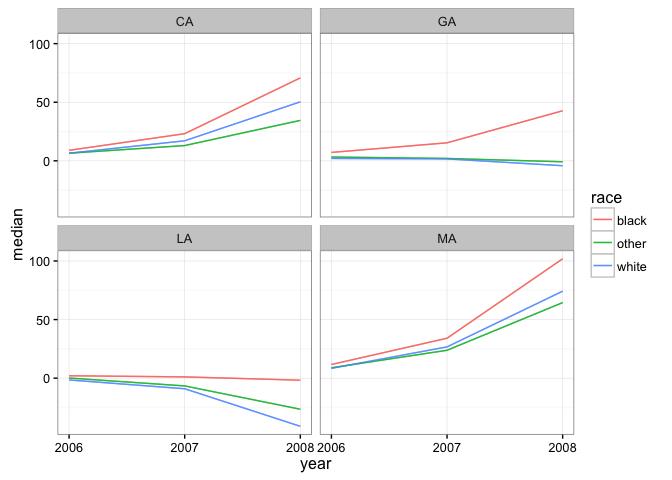

[](https://travis-ci.org/jamesdunham/dgirt)

dgirt is an R package for dynamic group-level IRT models as developed in [Caughey and Warshaw 2014](http://pan.oxfordjournals.org/content/early/2015/02/04/pan.mpu021.full.pdf+html).

Install
-------

Install dgirt from GitHub. Installation requires [RStan](http://mc-stan.org/interfaces/rstan.html) and its prerequisites, in particular a C++ toolchain. If you don't have RStan, follow its "[Getting Started](https://github.com/stan-dev/rstan/wiki/RStan-Getting-Started)" guide.

    devtools::install_github("jamesdunham/dgirt", dependencies = TRUE)

RStan's recommended options on a local, multicore machine with excess RAM are also appropriate for dgirt:

``` r
library(dgirt)
#> Loading required package: Rcpp
rstan_options(auto_write = TRUE)
options(mc.cores = parallel::detectCores())
```

Getting started
---------------

The minimal workflow from raw data to estimation is:

1.  shape input data using the `shape` function; and
2.  pass the result to the `dgirt` function to fit a dgirt model.

### Prepare input data with `shape`

The following example models responses to a single survey item in the bundled `opinion` data. dgirt models are *dynamic*, so we need to specify which variable in the data represents time. They are also *group-level*, with groups defined by one variable for respondents' local geographic area and one or more variables for respondent characteristics.

The `time_filter` and `geo_filter` arguments optionally subset the data. `time_filter` can also be used to include unobserved periods in the model. Finally, `shape` requires the names of the survey identifier and survey weight variables in the data.

``` r
dgirt_in <- shape(opinion, item_names = "Q_cces2006_abortion",
                  time_name = "year", geo_name = "state", group_names = "race",
                  geo_filter = c("CA", "GA", "LA", "MA"),
                  survey_name = "source", weight_name = "weight")
#> Applying restrictions, pass 1...
#>  Dropped 5 rows for missingness in covariates
#>  Dropped 555 rows for lacking item responses
#> Applying restrictions, pass 2...
#>  No changes
```

The reshaped and subsetted data can be summarized in a few ways before model fitting.

``` r
summary(dgirt_in)
#> Items:
#> [1] "Q_cces2006_abortion"
#> Respondents:
#>    11,662 in `item_data` (unadjusted)
#> Grouping variables:
#> [1] "year"  "state" "race" 
#> Time periods:
#> [1] 2006 2007 2008
#> Local geographic areas:
#> [1] "CA" "GA" "LA" "MA"
#> Hierarchical parameters:
#> [1] "GA"        "LA"        "MA"        "raceother" "racewhite"
#> Modifiers of hierarchical parameters:
#> character(0)
#> Constants:
#>  Q  T  P  N  G  H  D 
#>  1  3  5 36 12  1  1
get_n(dgirt_in, by = c("year", "source"))
#>    year    source    n
#> 1: 2006 CCES_2006 5275
#> 2: 2007 CCES_2007 1690
#> 3: 2008 CCES_2008 4697
get_item_n(dgirt_in, by = "year")
#>    year Q_cces2006_abortion
#> 1: 2006                5275
#> 2: 2007                1690
#> 3: 2008                4697
```

### Fit a model with `dgirt`

We use `dgirt` to fit a model to data from `shape`. Under the hood, this function uses RStan for MCMC sampling, and arguments can be passed to RStan's `stan` via the `...` argument of `dgirt`. This will almost always be desirable, at a minimum to specify the number of sampler iterations, chains, and cores.

``` r
dgirt_out <- dgirt(dgirt_in, iter = 1500, chains = 4, cores = 4, seed = 42,
                   refresh = 0)
```

The model results are held in a `dgirtfit` object. This means that methods from RStan like `extract` are available if needed. But dgirt provides its own methods for typical post-estimation tasks.

### Work with `dgirt` results

For a high-level summary of the result, use `summary`.

``` r
summary(dgirt_out)
#> dgirt samples from 4 chains of 1500 iterations, 750 warmup, thinned every 1 
#>   Drawn Tue Jun 14 09:46:25 2016 
#>   Package version not available (< 0.2.2) 
#>   Model version 2016_04_20 
#>   86 parameters; 36 theta_bars (year, state and race)
#>   3 periods 2006 to 2008 
#> 
#> n_eff
#>    Min. 1st Qu.  Median    Mean 3rd Qu.    Max. 
#>   14.87  207.20  332.80  706.90  769.10 3000.00 
#> 
#> Rhat
#>    Min. 1st Qu.  Median    Mean 3rd Qu.    Max.    NA's 
#>  0.9987  1.0060  1.0170  1.0150  1.0230  1.0440       1
```

To summarize posterior samples, use `summarize`. The default output gives summary statistics for the `theta_bar` parameters, which represent the mean of the latent outcome for the groups defined by time, local geographic area, and the demographic characteristics specified in the earlier call to `shape`.

``` r
summarize(dgirt_out)
#>         param state  race year        mean         sd       median
#>  1: theta_bar    CA black 2006  10.1783840   5.154298   9.21579611
#>  2: theta_bar    CA black 2007  28.6757279  20.659388  23.42522881
#>  3: theta_bar    CA black 2008 140.1491684 234.721772  61.04397619
#>  4: theta_bar    CA other 2006   7.5087801   3.866240   6.76632563
#>  5: theta_bar    CA other 2007  16.8367059  13.273454  13.51326088
#>  6: theta_bar    CA other 2008  75.7255300 138.758648  30.13313021
#>  7: theta_bar    CA white 2006   7.3647375   3.670777   6.68848315
#>  8: theta_bar    CA white 2007  21.1761928  14.849486  17.60975425
#>  9: theta_bar    CA white 2008  97.4976873 160.271008  43.32026624
#> 10: theta_bar    GA black 2006   8.2682419   4.308085   7.40594498
#> 11: theta_bar    GA black 2007  19.8359831  15.759313  15.78736208
#> 12: theta_bar    GA black 2008  89.4606800 156.772580  37.32120679
#> 13: theta_bar    GA other 2006   3.9279664   2.631318   3.35157214
#> 14: theta_bar    GA other 2007   3.3293869   8.503309   1.99519851
#> 15: theta_bar    GA other 2008   1.9704036  64.607092  -1.01611895
#> 16: theta_bar    GA white 2006   2.4062512   1.364987   2.13641067
#> 17: theta_bar    GA white 2007   2.3837484   3.840942   1.66868663
#> 18: theta_bar    GA white 2008  -8.2277029  28.769625  -4.18542411
#> 19: theta_bar    LA black 2006   2.5901626   2.143351   2.16696176
#> 20: theta_bar    LA black 2007   2.0700925   6.861788   1.49434430
#> 21: theta_bar    LA black 2008  -1.3949747  47.308607  -1.55754857
#> 22: theta_bar    LA other 2006   0.2164769   2.402552   0.08052373
#> 23: theta_bar    LA other 2007  -8.1767409  10.420386  -6.31183764
#> 24: theta_bar    LA other 2008 -57.5061495 106.853869 -24.76840297
#> 25: theta_bar    LA white 2006  -1.9043446   1.506080  -1.56537887
#> 26: theta_bar    LA white 2007 -11.3325847   9.262449  -8.84843476
#> 27: theta_bar    LA white 2008 -77.5922288 117.661450 -36.70334571
#> 28: theta_bar    MA black 2006  13.3597880   6.891625  11.89909284
#> 29: theta_bar    MA black 2007  43.0731947  29.660330  35.71147279
#> 30: theta_bar    MA black 2008 205.0983691 338.622223  90.33508381
#> 31: theta_bar    MA other 2006  10.2500485   5.424927   9.26182809
#> 32: theta_bar    MA other 2007  29.9792545  22.297994  24.78322435
#> 33: theta_bar    MA other 2008 133.9016343 234.190336  57.15242284
#> 34: theta_bar    MA white 2006   9.5473423   4.789013   8.59759936
#> 35: theta_bar    MA white 2007  32.8486671  21.861877  27.71128936
#> 36: theta_bar    MA white 2008 145.6829214 238.065557  64.17700429
#>         param state  race year        mean         sd       median
#>            q_025        q_975
#>  1:    3.1155550   23.7086819
#>  2:    6.8371637   82.5814374
#>  3:    8.2583533  805.3522650
#>  4:    2.2121960   16.8860319
#>  5:    3.5659762   50.7522511
#>  6:    3.0844126  471.0773713
#>  7:    2.3437977   16.6911425
#>  8:    5.2791924   56.6607516
#>  9:    5.9238111  556.4075350
#> 10:    2.4229394   19.0616946
#> 11:    4.0576387   58.4639998
#> 12:    4.1711179  514.3227980
#> 13:    0.4895117   10.4655598
#> 14:   -9.8080030   23.0288058
#> 15:  -78.3092301  113.4156466
#> 16:    0.6079124    5.7308249
#> 17:   -2.9960586   11.7120838
#> 18:  -65.7817394   20.9515471
#> 19:   -0.3445474    8.1109730
#> 20:  -10.8996770   17.4174756
#> 21:  -83.9464928   89.9639052
#> 22:   -4.3270279    5.3252195
#> 23:  -33.4896707    8.6878184
#> 24: -329.4388599   10.4615276
#> 25:   -5.9470300    0.1054171
#> 26:  -34.5766354   -0.6985035
#> 27: -405.9435828   -4.8537516
#> 28:    4.0379472   30.5041425
#> 29:   10.6602152  115.7860715
#> 30:   11.6850546 1200.1301890
#> 31:    2.8912746   22.8764571
#> 32:    6.7686103   84.3154085
#> 33:    5.5421754  801.7730088
#> 34:    3.0295938   20.7599436
#> 35:    8.5392350   86.7140199
#> 36:    8.2475177  817.3714253
#>            q_025        q_975
```

Alternatively, `summarize` can apply arbitrary functions to posterior samples for whatever parameter is given by its `pars` argument. Enclose function names with quotes. For convenience, `"q_025"` and `"q_975"` give the 2.5th and 97.5th posterior quantiles.

``` r
summarize(dgirt_out, pars = "xi", funs = "var")
#>    param year      var
#> 1:    xi 2006 28.36908
#> 2:    xi 2007 28.42035
#> 3:    xi 2008 70.96994
```

To access posterior samples in tabular form use `as.data.frame`. By default, this method returns post-warmup samples for the `theta_bar` parameters, but like other methods takes a `pars` argument.

``` r
as.data.frame(dgirt_out)
```

To poststratify the results use `poststratify`. The following example uses the group population proportions bundled as `state_year_targets` to reweight and aggregate estimates to strata defined by state-years. Read `help("poststratify")` for more details.

``` r
poststratify(dgirt_out, state_year_targets, strata_names = c("state", "year"),
             aggregated_names = "race")
#>     state year       value
#>  1:    CA 2006   7.6052407
#>  2:    CA 2007  20.6405466
#>  3:    CA 2008  95.1196388
#>  4:    GA 2006   4.1882329
#>  5:    GA 2007   7.6033856
#>  6:    GA 2008  21.4947669
#>  7:    LA 2006  -0.4809496
#>  8:    LA 2007  -7.1734744
#>  9:    LA 2008 -53.8304627
#> 10:    MA 2006   9.7838334
#> 11:    MA 2007  33.1545537
#> 12:    MA 2008 147.8684415
```

To plot the results use `dgirt_plot`. This method plots summaries of posterior samples by time period. By default, it shows a 95% credible interval around posterior medians for the `theta_bar` parameters, for each local geographic area. For this toy example we omit the CIs.

``` r
dgirt_plot(dgirt_out, y_min = NULL, y_max = NULL)
```



Output from `dgirt_plot` can be customized to some extent using objects from the ggplot2 package.

``` r
dgirt_plot(dgirt_out, y_min = NULL, y_max = NULL) + theme_classic()
```


