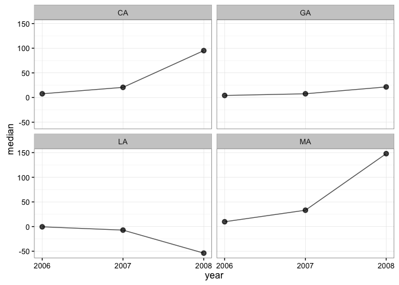

[](https://travis-ci.org/jamesdunham/dgirt)

dgirt is an R package for dynamic group-level IRT models as developed in [Caughey and Warshaw 2014](http://pan.oxfordjournals.org/content/early/2015/02/04/pan.mpu021.full.pdf+html).

Install
-------

Install dgirt from GitHub. Installation requires [RStan](http://mc-stan.org/interfaces/rstan.html) and its prerequisites, in particular a C++ toolchain. If you don't have RStan, follow its "[Getting Started](https://github.com/stan-dev/rstan/wiki/RStan-Getting-Started)" guide.

    devtools::install_github("jamesdunham/dgirt", dependencies = TRUE)

RStan's recommended options on a local, multicore machine with excess RAM are also appropriate for dgirt:

``` r
library(dgirt)
rstan_options(auto_write = TRUE)
options(mc.cores = parallel::detectCores())
```

Getting started
---------------

The minimal workflow from raw data to estimation is:

1.  shape input data using the `shape` function; and
2.  pass the result to the `dgirt` function to fit a dgirt model.

### Prepare input data with `shape`

The following example models responses to a single survey item in the bundled `opinion` data. dgirt models are *dynamic*, so we need to specify which variable in the data represents time. They are also *group-level*, with groups defined by one variable for respondents' local geographic area and one or more variables for respondent characteristics.

The `time_filter` and `geo_filter` arguments optionally subset the data. `time_filter` can also be used to include unobserved periods in the model. Finally, `shape` requires the names of the survey identifier and survey weight variables in the data.

``` r
dgirt_in <- shape(opinion, item_names = "Q_cces2006_abortion",
                  time_name = "year", geo_name = "state", group_names = "race",
                  geo_filter = c("CA", "GA", "LA", "MA"),
                  survey_name = "source", weight_name = "weight")
#> Applying restrictions, pass 1...
#>  Dropped 5 rows for missingness in covariates
#>  Dropped 555 rows for lacking item responses
#> Applying restrictions, pass 2...
#>  No changes
#> Warning in `[.data.table`(item_n, , `:=`(c(drop_cols), NULL), with =
#> FALSE): length(LHS) = 0, meaning no columns to delete or assign RHS to.
```

The reshaped and subsetted data can be summarized in a few ways before model fitting.

``` r
summary(dgirt_in)
#> Items:
#> [1] "Q_cces2006_abortion"
#> Respondents:
#>    11,662 in `item_data` (unadjusted)
#> Grouping variables:
#> [1] "year"  "state" "race" 
#> Time periods:
#> [1] 2006 2007 2008
#> Local geographic areas:
#> [1] "CA" "GA" "LA" "MA"
#> Hierarchical parameters:
#> [1] "GA"        "LA"        "MA"        "raceother" "racewhite"
#> Modifiers of hierarchical parameters:
#> character(0)
#> Constants:
#>  Q  T  P  N  G  H  D 
#>  1  3  5 36 12  1  1
get_n(dgirt_in, by = c("year", "source"))
#>    year    source    n
#> 1: 2006 CCES_2006 5275
#> 2: 2007 CCES_2007 1690
#> 3: 2008 CCES_2008 4697
get_item_n(dgirt_in, by = "year")
#>    year Q_cces2006_abortion
#> 1: 2006                5275
#> 2: 2007                1690
#> 3: 2008                4697
```

### Fit a model with `dgirt`

`dgirt` fits a model to data from `shape`. Under the hood, this function uses RStan for MCMC sampling, and arguments can be passed to RStan's `stan` via the `...` argument of `dgirt`. This will almost always be desirable, at a minimum to specify the number of sampler iterations, chains, and cores.

``` r
dgirt_out <- dgirt(dgirt_in, iter = 1500, chains = 4, cores = 4, seed = 42,
                   refresh = 0)
```

The model results are held in a `dgirtfit` object. Methods from RStan like `extract` are available if needed because `dgirtfit` inherits from `stanfit`. But dgirt provides its own methods for typical post-estimation tasks.

### Work with `dgirt` results

For a high-level summary of the result, use `summary`.

``` r
summary(dgirt_out)
#> dgirt samples from 4 chains of 1500 iterations, 750 warmup, thinned every 1 
#>   Drawn Tue Jun 14 09:46:25 2016 
#>   Package version not available (< 0.2.2) 
#>   Model version 2016_04_20 
#>   86 parameters; 36 theta_bars (year, state and race)
#>   3 periods 2006 to 2008 
#> 
#> n_eff
#>    Min. 1st Qu.  Median    Mean 3rd Qu.    Max. 
#>   14.87  207.20  332.80  706.90  769.10 3000.00 
#> 
#> Rhat
#>    Min. 1st Qu.  Median    Mean 3rd Qu.    Max.    NA's 
#>  0.9987  1.0060  1.0170  1.0150  1.0230  1.0440       1
```

To summarize posterior samples, use `summarize`. The default output gives summary statistics for the `theta_bar` parameters, which represent the mean of the latent outcome for the groups defined by time, local geographic area, and the demographic characteristics specified in the earlier call to `shape`.

``` r
head(summarize(dgirt_out))
#>        param state  race year      mean         sd    median    q_025
#> 1: theta_bar    CA black 2006  10.17838   5.154298  9.215796 3.115555
#> 2: theta_bar    CA black 2007  28.67573  20.659388 23.425229 6.837164
#> 3: theta_bar    CA black 2008 140.14917 234.721772 61.043976 8.258353
#> 4: theta_bar    CA other 2006   7.50878   3.866240  6.766326 2.212196
#> 5: theta_bar    CA other 2007  16.83671  13.273454 13.513261 3.565976
#> 6: theta_bar    CA other 2008  75.72553 138.758648 30.133130 3.084413
#>        q_975
#> 1:  23.70868
#> 2:  82.58144
#> 3: 805.35226
#> 4:  16.88603
#> 5:  50.75225
#> 6: 471.07737
```

Alternatively, `summarize` can apply arbitrary functions to posterior samples for whatever parameter is given by its `pars` argument. Enclose function names with quotes. For convenience, `"q_025"` and `"q_975"` give the 2.5th and 97.5th posterior quantiles.

``` r
summarize(dgirt_out, pars = "xi", funs = "var")
#>    param year      var
#> 1:    xi 2006 28.36908
#> 2:    xi 2007 28.42035
#> 3:    xi 2008 70.96994
```

To access posterior samples in tabular form use `as.data.frame`. By default, this method returns post-warmup samples for the `theta_bar` parameters, but like other methods takes a `pars` argument.

``` r
head(as.data.frame(dgirt_out))
#>        param state  race year iteration     value
#> 1: theta_bar    CA black 2006         1  8.024511
#> 2: theta_bar    CA black 2006         2  5.436505
#> 3: theta_bar    CA black 2006         3  5.027471
#> 4: theta_bar    CA black 2006         4 13.951022
#> 5: theta_bar    CA black 2006         5  9.436819
#> 6: theta_bar    CA black 2006         6  9.541294
```

To poststratify the results use `poststratify`. The following example uses the group population proportions bundled as `state_year_targets` to reweight and aggregate estimates to strata defined by state-years. Read `help("poststratify")` for more details.

``` r
poststratify(dgirt_out, state_year_targets, strata_names = c("state", "year"),
             aggregated_names = "race")
#>     state year       value
#>  1:    CA 2006   7.6052407
#>  2:    CA 2007  20.6405466
#>  3:    CA 2008  95.1196388
#>  4:    GA 2006   4.1882329
#>  5:    GA 2007   7.6033856
#>  6:    GA 2008  21.4947669
#>  7:    LA 2006  -0.4809496
#>  8:    LA 2007  -7.1734744
#>  9:    LA 2008 -53.8304627
#> 10:    MA 2006   9.7838334
#> 11:    MA 2007  33.1545537
#> 12:    MA 2008 147.8684415
```

To plot the results use `dgirt_plot`. This method plots summaries of posterior samples by time period. By default, it shows a 95% credible interval around posterior medians for the `theta_bar` parameters, for each local geographic area. For this (unconverged) toy example we omit the CIs.

``` r
dgirt_plot(dgirt_out, y_min = NULL, y_max = NULL)
```


Output from `dgirt_plot` can be customized to some extent using objects from the ggplot2 package.

``` r
dgirt_plot(dgirt_out, y_min = NULL, y_max = NULL) + theme_classic()
```


`dgirt_plot` can also plot the `data.frame` output from `poststratify`. This requires arguments that identify the relevant variables in the `data.frame`. Below, `poststratify` aggregates over the demographic grouping variable `race`, resulting in a `data.frame` of estimates by state-year. So, in the subsequent call to `dgirt_plot`, we pass the names of the state and year variables. The `group_names` argument is `NULL` because there are no grouping variables left after aggregating over `race`.

``` r
ps <- poststratify(dgirt_out, state_year_targets,
                   strata_names = c("state", "year"), aggregated_names = "race")
head(ps)
#>    state year     value
#> 1:    CA 2006  7.605241
#> 2:    CA 2007 20.640547
#> 3:    CA 2008 95.119639
#> 4:    GA 2006  4.188233
#> 5:    GA 2007  7.603386
#> 6:    GA 2008 21.494767
dgirt_plot(ps, group_names = NULL, time_name = "year", geo_name = "state")
```



Troubleshooting
---------------

OS X only: RStan creates temporary files during estimation in a location given by `tempdir`, typically an arbitrary location in `/var/folders`. If a model runs for days, these files can be cleaned up while still needed, which induces an error. A good solution is to set a safer path for temporary files, using an environment variable checked at session startup. As described in `?tempdir`,

> The environment variables ‘TMPDIR’, ‘TMP’ and ‘TEMP’ are checked in turn and the first found which points to a writable directory is used: if none succeeds ‘/tmp’ is used. The path should not contain spaces.

For help setting environment variables, see the Stack Overflow question [here](https://stackoverflow.com/questions/17107206/change-temporary-directory). Confirm the new path before starting your model run by restarting R and checking the output from `tempdir()`.

``` r
# Problematic temporary directories on OS X look like this
tempdir()   
#> [1] "/var/folders/2p/_d3c95qd6ljg28j1f5l2jqxm0000gn/T//Rtmp6t0Jn8"
```
