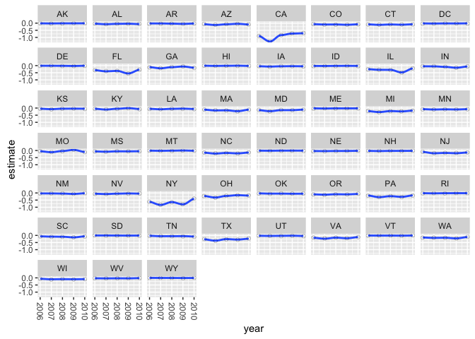

<!-- README.md is generated from README.Rmd. Please edit that file -->
dgirt
=====

dgirt is an R package for dynamic group-level IRT models, as developed in [Caughey and Warshaw 2014](http://pan.oxfordjournals.org/content/early/2015/02/04/pan.mpu021.full.pdf+html):

> Over the past eight decades, millions of people have been surveyed on their political opinions. Until recently, however, polls rarely included enough questions in a given domain to apply scaling techniques such as IRT models at the individual level, preventing scholars from taking full advantage of historical survey data. To address this problem, we develop a Bayesian group-level IRT approach that models latent traits at the level of demographic and/or geographic groups rather than individuals. We use a hierarchical model to borrow strength cross-sectionally and dynamic linear models to do so across time. The group-level estimates can be weighted to generate estimates for geographic units. This framework opens up vast new areas of research on historical public opinion, especially at the subnational level.

Installation
------------

``` r
devtools::install_github("jamesdunham/dgirt")
#> Downloading GitHub repo jamesdunham/dgirt@master
#> Installing dgirt
#> '/Library/Frameworks/R.framework/Resources/bin/R' --no-site-file  \
#>   --no-environ --no-save --no-restore CMD INSTALL  \
#>   '/private/var/folders/2p/_d3c95qd6ljg28j1f5l2jqxm0000gn/T/RtmpZNIpjr/devtoolsb34548ab5ab/jamesdunham-dgirt-e0d88d6'  \
#>   --library='/Library/Frameworks/R.framework/Versions/3.2/Resources/library'  \
#>   --install-tests 
#> 
#> Reloading installed dgirt
```

Get updates by reinstalling. dgirt is in early stages and under development. See [NEWS](NEWS.md), last updated 2015-12-30.

Quick start
-----------

-   `wrangle` prepares data
-   `dgirt` fits models
-   `poststratify` reweights estimates

Use
---

`state_opinion` is a dataset included with `dgirt` in which rows correspond to survey responses from individuals.

``` r
library(dgirt)
data(state_opinion)
```

Data formatted in this way need to be restructured with the `wrangle` function. We'll pass `state_opinion` to `wrangle`'s `data` argument, which takes a list of data to be used in modeling. Our table of survey responses will be an element named `level1`, for the lowest hierarchical level in the model. (Note: at the moment, there are limitations on model specifications. Level-one data is required and a second hierarchical level is optional.)

We'll use the `vars` argument to identify variables of importance in `data` (e.g. which represent item responses). `vars` is a list of named character vectors with (at least) these elements:

-   `items`: Names of item response variables in `data$level1`.
-   `groups`: Names of respondent characteristic variables in `data$level1`. (Note: at this time, `wrangle` requires that the user exclude the geographic indicator from `groups` and name it instead in `geo_id`. Modeling any group predictor is coming.)
-   `time_id`: Name of time period variable in `data$level1`.
-   `geo_id`: Name of geographic identifier variable in `data$level1`.
-   `survey_id`: Name of survey identifier variable in `data$level1`.
-   `survey_weight`: Name of weight variable in `data$level1`.

The names of the item response variables start with "Q\_", so we'll pass them using `grep`.

``` r
state_opinion_fmt = wrangle(
  data = list(level1 = state_opinion),
  vars = list(items = grep("^Q_", colnames(state_opinion), value = TRUE),
              groups = c("race"),
              time_id = "year",
              geo_id = "state",
              survey_id = "source",
              survey_weight = "weight"),
  filters = list(periods = as.character(2006:2010)))
#> 5 rows dropped for missingness in covariates
#> 0 rows have no responses
#> 
#> 
#> 
#> 0 rows have no responses
#> 2 questions have no responses: Q_naes2000_jobdiscgays, Q_anwr_drilling
#> 
#> 
#> 0 rows have no responses
```

`wrangle` returns a list of objects that `dgirt` expects as its first argument. We'll also set its `n_iter` and `n_chain` arguments to minimize its run time, but otherwise rely on the defaults.

`dgirt()` calls `rstan()`, which reports any problems it encounters when compiling the model and sampling. Reporting is verbose and not all messages indicate problems. If sampling is successful, `dgirt()` returns an object of class `stanfit`. (See rstan documentation.)

``` r
dgirt_estimates = dgirt(state_opinion_fmt, n_iter = 100, n_chain = 1)
#> Started: Sun Jan 10 16:02:38 2016
#> Running 100 iterations in each of 1 chains. Thinning at an interval of 1 with 75 adaptation iterations.
#> 
#> SAMPLING FOR MODEL '605ba6820a8c93e8038f6394fbb2c3e1' NOW (CHAIN 1).
#> 
#> Chain 1, Iteration:  1 / 100 [  1%]  (Warmup)
#> Chain 1, Iteration: 10 / 100 [ 10%]  (Warmup)
#> Chain 1, Iteration: 20 / 100 [ 20%]  (Warmup)
#> Chain 1, Iteration: 30 / 100 [ 30%]  (Warmup)
#> Chain 1, Iteration: 40 / 100 [ 40%]  (Warmup)
#> Chain 1, Iteration: 50 / 100 [ 50%]  (Warmup)
#> Chain 1, Iteration: 60 / 100 [ 60%]  (Warmup)
#> Chain 1, Iteration: 70 / 100 [ 70%]  (Warmup)
#> Chain 1, Iteration: 76 / 100 [ 76%]  (Sampling)
#> Chain 1, Iteration: 85 / 100 [ 85%]  (Sampling)
#> Chain 1, Iteration: 95 / 100 [ 95%]  (Sampling)
#> Chain 1, Iteration: 100 / 100 [100%]  (Sampling)
#> #  Elapsed Time: 119.304 seconds (Warm-up)
#> #                39.152 seconds (Sampling)
#> #                158.456 seconds (Total)
#> The following numerical problems occured the indicated number of times after warmup on chain 1
#>                                                                                              count
#> validate transformed params: disc[1] is nan, but must be greater than or equal to 0              3
#> Exception thrown at line 193: lognormal_log: Location parameter is -inf, but must be finite!     1
#> Exception thrown at line 196: normal_log: Scale parameter is 0, but must be > 0!                 1
#> When a numerical problem occurs, the Metropolis proposal gets rejected.
#> However, by design Metropolis proposals sometimes get rejected even when there are no numerical problems.
#> Thus, if the number in the 'count' column is small, do not ask about this message on stan-users.
#> Ended: Sun Jan 10 16:05:18 2016
```

To examine the the `dgirt()` results we can use `extract_dgirt()`, which attaches labels to the saved parameters according to the variable names originally passed to `wrangle()` and any factor levels. Right now, `extract_dgirt()` shows only the posterior means.

Note that `dgirt()` returns a `stanfit` object when `method = "rstan"` (as above, the default) and a list of point estimates if `method = "optimize"` (details below); `extract_dgirt()` only works with `stanfit` objects. (The inconsistency in return types isn't desirable and will change in the future.)

The group means can be found as `theta_bar`.

``` r
dgirt_extract = extract_dgirt(dgirt_estimates, state_opinion_fmt)
head(dgirt_extract$theta_bar)
#> Source: local data frame [6 x 6]
#> 
#>    Var1  Var2      value  year  state   race
#>   (int) (int)      (dbl) (chr) (fctr) (fctr)
#> 1     1     1  -9.854343  2006     AK      1
#> 2     2     1  -9.050622  2007     AK      1
#> 3     3     1 -10.691861  2008     AK      1
#> 4     4     1  -7.684796  2009     AK      1
#> 5     5     1  -6.837448  2010     AK      1
#> 6     1     2  -9.784565  2006     AK      2
```

`cmdstan`
---------

We can use the `method` argument of `dgirt` to choose an alternative to MCMC sampling if `cmdstan` is available. See <http://mc-stan.org/interfaces/cmdstan.html> for installation instructions. For example, setting `method = "optimize"` will call `cmdstan optimize`. Passing `optimize_algorithm = "newton"` will use Newton-Raphson instead of the default LFBGS.

``` r
point_estimates = dgirt(state_opinion_fmt, n_iter = 20, method = "optimize",
  optimize_algorithm = "newton", init_range = 0.5)
#> Started: Sun Jan 10 16:05:18 2016
#> Reading results from disk.
#> Ended: Sun Jan 10 16:05:47 2016
head(point_estimates$theta_bar)
#> Source: local data frame [6 x 5]
#> 
#>           param      value  year  state   race
#>          (fctr)      (dbl) (chr) (fctr) (fctr)
#> 1 theta_bar.1.1 -0.1030800  2006     AK      1
#> 2 theta_bar.2.1  0.1401800  2007     AK      1
#> 3 theta_bar.3.1 -0.3460930  2008     AK      1
#> 4 theta_bar.4.1 -0.6199390  2009     AK      1
#> 5 theta_bar.5.1 -0.0667483  2010     AK      1
#> 6 theta_bar.1.2 -0.2945820  2006     AK      2
```

`poststratify`
--------------

The `state_demographics` dataset contains population proportions for demographic strata by year.

``` r
data(state_demographics)
head(state_demographics)
#> Source: local data frame [6 x 7]
#> 
#>    state  year              race female education   age   proportion
#>   (fctr) (int)            (fctr) (fctr)     (int) (int)        (dbl)
#> 1     AK  1960 White or Hispanic   Male         1     1 8.857296e-05
#> 2     AL  1960 White or Hispanic   Male         1     1 6.986948e-04
#> 3     AR  1960 White or Hispanic   Male         1     1 3.831912e-04
#> 4     AZ  1960 White or Hispanic   Male         1     1 3.518153e-04
#> 5     CA  1960 White or Hispanic   Male         1     1 3.463380e-03
#> 6     CO  1960 White or Hispanic   Male         1     1 3.543790e-04
```

`poststratify()` can use data like these with the `dgirt()` estimates to compute weighted means for groups or arbitrary aggregations of groups.

At the moment, it's necessary to relabel the group factor levels in the `dgirt()` results to match those in the population proportion data. And the time variable in the `dgirt()` results needs to be recast as integer.

``` r
point_estimates$theta_bar$race = factor(point_estimates$theta_bar$race, labels = c("White or Hispanic", "Black", "Other"))
point_estimates$theta_bar$year = as.integer(point_estimates$theta_bar$year)
```

Now we pass these data, the same `groups` argument as used originally with `wrangle`, and a vector of variable names as `strata` that define aggregations of interest in the data. For exposition we'll set two optional variables. We give the name of the variable in the demographic data for the population proportion as `prop_var`. And passing a variable name to `check_proportions` will test the demographic data for whether population proportions sum to one within groups defined by the values of that variable.

``` r
group_means = poststratify(
  group_means = point_estimates$theta_bar,
  targets =  state_demographics,
  groups = c("race"),
  strata = c("state", "year"),
  prop_var = "proportion",
  check_proportions = "year")
#> Warning in poststratify(group_means = point_estimates$theta_bar, targets
#> = state_demographics, : More rows of proportions than combinations of its
#> strata and grouping variables. Summing proportions over other variables.
head(group_means)
#> Source: local data frame [6 x 3]
#> 
#>    state  year         value
#>   (fctr) (int)         (dbl)
#> 1     AK  2006 -2.473858e-05
#> 2     AK  2007  2.519670e-04
#> 3     AK  2008 -6.534113e-04
#> 4     AK  2009 -1.250092e-03
#> 5     AK  2010 -2.503072e-04
#> 6     AL  2006 -1.987406e-03
```

`plot_means`
------------

We can quickly plot the estimates to check the model. `plot_means` takes the result of `poststratify` `theta_bar` in the result of `dgirt_extract`, or `theta_bar` in the result of `dgirt` with `method = "optimize"`.

``` r
# The time variable needs to be numeric. At the moment only poststratify()
# ensures this.
point_estimates$theta_bar$year <- as.integer(optimized_theta_bars$year)
dgirt_extract$theta_bar$year <- as.integer(dgirt_extract$theta_bar$year)
```

``` r
plot_means(group_means, "year", "state", jitter = TRUE)
```



``` r
# plot_means(dgirt_extract$theta_bar, "year", "state", jitter = TRUE)
# plot_means(point_estimates$theta_bar, "year", "state", jitter = TRUE)
```
